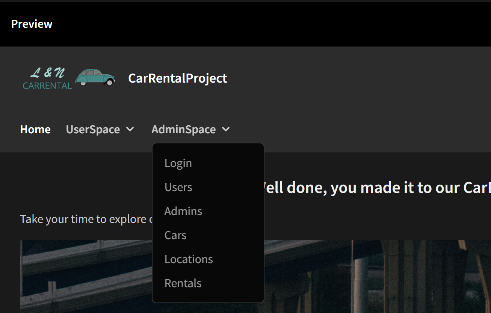

# Car_Rental_Project_Internet_Technology
Our fundamental concept of this group project is to create a functional Web application to practise and use the knowledge we have learned from the lectures and e-lectures.

#### Contents:
- [Analysis](#analysis)
  - [Scenario Ideation](#scenario-ideation)
  - [User Story Writing](#user-story-writing)
  - [Use Case](#use-case)
- [Design](#design)
  - [Prototype Design](#prototype-design)
  - [Domain Design](#domain-design)
  - [Business Logic](#business-logic)
- [Implementation](#implementation)
  - [Backend Technology](#backend-technology)
  - [Frontend Technology](#frontend-technology)
- [Project Management](#project-management)
  - [Roles](#roles)

## Analysis
In our analysis, we specify the following sections to ensure a comprehensive understanding of the requirements and functionalities of our web application. 

### Scenario Ideation

L&N CARRENTAL (Car_Rental_Project) is a Web application allowing the car rental manager (Role: Admin) and the customers (Role: User) to manage car rental operations.

### User Story Writing

1. As an admin, I want to have a Web application so that I can use it on different mobile devices and on desktop computers.
2. As an admin, I want to see a consistent visual appearance so that I can navigate easily, and it looks consistent.
3. As an admin, I want to use list views so that I can explore and read my business data (get).
4. As an admin, I want to update (put) and create (post) views so that I can maintain my business data.
5. As an admin, I want to delete (delete) specific data entries to maintain my business data.
6. As an admin, I want to see the frequency of cars rented (business logic).
7. As an admin, I want the system to validate my credentials during login to ensure security.
8. As an admin, I want to be notified with error messages if I provide invalid credentials during login.
9. As a user, I want to have a Web applicatioon so that I can use it on different mobile devices and on desktop computers.
10. As a user, I want to see a consistent visual appearance so that I can navigate easily, and it looks consistent.
11. As a user, I want to search for available cars in a specific period of time (business logic).
12. As a user, I want to see information about the company.
13. As a suer, I want to be able to contact the company.
14. As a user, I want the appication to validate my credentials during login to ensure security.
15. As a user, I want to be notified with error messages if I provide invalid credentials during login.

#### Some stories as more detailed scenarios:

#### Scenario 1: Admin Login
------------------------------------------------------------
Descripiton: The admin logs in to see all the business data.

Steps:
1. Admin navigates to the login screen.
2. Admin enters the credentials (username & password)
3. System verifies the credentials.
4. Admin can navigate to the business data screens.
5. Admin logs out.


#### Scenario 2: Admin Management
------------------------------------------------------------
Description: The admin wants to maintain the DB, such as such as user management, admmin management, car inventory management, location management and rental management. 

Steps: 
1. Admin navigates to the login sceen.
2. Admin enters the credentials (username & password)
3. System verifies the credentials.
4. Admin can navigate int the "AdminSpace" with five management screens: users, admins, cars, locations and rentals.
5. Admin can make CRUD-operations.
6. Admin logs out. 


#### Scenario 3: User Registration
------------------------------------------------------------
Descripiton: The user logs in to see business data.

Steps:
1. User navigates to the login screen.
2. User enters the credentials (username & password)
3. System verifies the credentials.
4. User can navigate in the "UserSpace".
5. User logs out.


#### Scenario 4: Searching for Available Cars
------------------------------------------------------------
Description: A logged in user wants to search for available cars for rental.

Steps: 
1. User navigates to the available cars screen.
2. User picks a start and and end date of the rental.
3. User submits the search request (refresh).
5. Application retrieves and displays a list of available cars matching the search criteria.
6. User logs out.


#### Scenario 5: Frequency of Rental
------------------------------------------------------------
Description: A logged in admin wants to see the frequency of cars rented.

Steps: 
1. Admin navigates to the cars screen to see the frequency.
2. An overview of the frequency of rentals is provided.
3. Admin logs out.


### Use Case

#### Use Case 1: Admin Login
------------------------------------------------------------
Actors:         Admin, Application

Description:    Allows the admin to log in.

Precondition:   Admin navigates to the login screen.

Postcondition:  Admin is logged in.

Main Flow: 
1. Admin enters credentials (username & password).
2. System validates the credentials.
3. Credentials are correct.

Alternate Flows: 
Invalid input: If the admin provides invalid credentials, system displays error messages.


#### Use Case 2: Admin Management; Read
------------------------------------------------------------
Actors:         Admin, Application

Description:    Allows admin to read business data.

Precondition:   Admin is logged in.

Postcondition:  Information is displayed successfully.

Main Flow:
1. Admin navigates to a screen: users, admins, cars, location or rentals.
2. Admin reads the respectitive business data.


#### Use Case 3: Admin Management; Add
------------------------------------------------------------
Actors:         Admin, Application

Description:    Allows admin to add business data.

Precondition:   Admin is logged in.

Postcondition:  Create operation is successfully executed.

Main Flow:
1. Admin navigates to a screen: users, admins, cars, location or rentals.
2. Admin pushed the add button.
3. Admin is fowarded to the add screen.
4. Admin fills in the field in the form.
5. The form is validated.
6. The business data is added with the new entry.

Alternate Flows: 
Invalid input: If the admin provides invalid information, system displays error messages.


#### Use Case 4: Admin Management; Update
------------------------------------------------------------
Actors:         Admin, Application

Description:    Allows admin to update business data.

Precondition:   Admin is logged in.

Postcondition:  Update operation is successfully executed.

Main Flow:
1. Admin navigates to a screen: users, admins, cars, location or rentals.
2. Admin clicks on the row that should be updated.
3. Side panel on the right opens.
6. Admin fills in the field in the form.
7. Admin pushed the update button.
8. The form is validated.
9. The business data is updated with the new entry.

Alternate Flows: 
Invalid input: If the admin provides invalid information, system displays error messages.


#### Use Case 5: Admin Management; Delete
------------------------------------------------------------
Actors:         Admin, Application

Description:    Allows admin to delete business data.

Precondition:   Admin is logged in.

Postcondition:  Delete operation is successfully executed.

Main Flow:
1. Admin navigates to a screen: users, admins, cars, location or rentals.
2. Admin clicks on the row that should be deleted.
3. Side panel on the right opens.
6. Admin pushed the delete button.
7. The form is validated.
8. The business data is deleted.

Alternate Flows: 
None.


#### Use Case 6: Search for Available Cars
------------------------------------------------------------
Actors:         User, Application

Description:    Allows a user to search for available cars based on specified period of time.

Precondition:   User is logged in and navigates to the available cars screen.

Postcondition:  User views a list of available cars matching the search criteria.

Main Flow:
1. User specifies search criteria with a start date and an end date.
2. Application retrieves and displays available cars.

Alternate Flows: 
No cars available: If no cars match the search criteria, system displays a message.


#### Use Case 7: Rental Frequency Cars
------------------------------------------------------------
Actors:         Admin, Application

Description:    Allows an admin to see the rentalfrequency of cars.

Precondition:   Admin is logged in and navigates to the rental frequency screen.

Postcondition:  Admin views the desired information.

Main Flow:
1. Application retrieves and displays the information.

Alternate Flows: 
No data available: If no data is available, system displays a message.


### Design
This section outlines the design principles and guidelines that ensure our corporate identiy is consistenly reflected across our application. The L&N CARRENTAL logo features a sleek, modern car silhouette combined with the company name. The logo colors are grey and two nuances of turquoise, reflecting our brand’s identity.


#### Color Scheme
The primary colors are grey and turquoise the secondary colors are shades of dark turquoise. Some accent colors in turquoide are additionally used.

#### Graphics
We used custom-designed icons in turquoise shades to maintain consistency. Icons should be minimalistic and align with the overall dark theme of the website. High-quality images of cars with a dark filter overlay to blend seamlessly into the dark-themed layout.

#### Layout
There is a fixed horizontal navigation on the top. With a home screen and to sections "UserSpace" and "AdminSpace. The two space section are nested navigation element which provide by clicking further screens.

#### User Esperience (UX)
It is ensured that the website is fully responsive, providing a seamless experience across all devices. The navigation is keept simple and intuitive, with clear labels. Buttons, forms, and other interactive elements should have clear, responsive feedback.

Our dark-themed, turquoise-accented design provides a modern and elegant user experience, while our commitment to usability and accessibility ensures that every visitor can easily find and rent their perfect car. 

### Wireframe
Here is an overview of our wireframes which we have created with draw.io. Please zoom in to be able to read it. :)


### Prototype Design
The prototypes were developed in the low-code tool BudiBase and then progressively expanded and improved through the project work.

### Domain Design

We created an Entity-Relationship Model in Visual Paradigm.

#### Entities

Admins: Represents the administrators of the website.

Users: Represents individuals who interact with the application.

Cars: Represents the vehicles for rental.

Locations: Represents the rental locations where cars can be rented.

Rentals: Represents a rental transaction.


#### Relationships

##### Admin – User (UserManagement)
One-to-Many relationship indicates that an admin can edit multiple users.

##### Admin – Car (CarManagement)
One-to-Many relationship indicates that an admin can edit multiple cars.

##### User – Rental (MakeRental)
One-to-Many relationship indicating that a user can make multiple rentals, but each rental is associated with only one user.

##### Car – Rental (IsRentedFor)
One-to-Many relationship indicating that a car can be rented multiple times, but each rental is associated with only one car.

##### Rental – Location (TakesPlaceAt)
Many-to-One relationship: Many rentals can take place ate the same rental location, but each rental only takes place at  only one location.

##### Location – Car (IsLocatedAt)
One-to-Many relationship indicating that a location can have multiple cars available for rental, but each car is located at only one location.

#### Model


### Business Logic
> Our APIs are available in the swagger endpoint. The default Swagger US page is available at /swagger-ui.html.
>
> Based on UC-5, there will be all available cars in a specified period of time:
>
> ...
>
> Based on UC-6, there will be information about the frequency of rented cars (entities involved: cars and rentals):
>
> ...

## Implementation
To achieve the overall project goals for L&N CARRENTAL, we utilized a diverse set of applications and technologies, each serving a specific purpose in the development and enhancement of our website.

We used Visual Paradigm to create the entity relationship model. With the support of the tool draw.io we have worked out our wireframes. The logo was designed with Microsoft Powerpoint and uploaded to imgbb, to be able to implement it in Budibase. 

We have created a group workspace in Postman to test our APIs. GitHub was used for version control, code repository management, and collaboration among the development in our small team. GitHub Codespaces provided a cloud-based development environment that allowed us to develop and test code from anywhere, ensuring consistent setups and configurations. GitHub Copilot was used to enhance developer productivity by providing AI-powered code suggestions and completions, speeding up our coding process and reducing errors.

### Backend Technology
> As suggested we cloned the Pizza Reference Project to start, so did we. Our Web application relies on Spring Boot and the dependency to Spring Data,, Java Persistence API (JPA) and H2 Database. To bootstrap the application the Spring Initializr has been used.
>
Then, the following further dependencies are added to the project `pom.xml`:

- DB:
```XML
<dependency>
			<groupId>com.h2database</groupId>
			<artifactId>h2</artifactId>
			<scope>runtime</scope>
</dependency>
```

- SWAGGER:
```XML
   <dependency>
      <groupId>org.springdoc</groupId>
      <artifactId>springdoc-openapi-starter-webmvc-ui</artifactId>
      <version>2.3.0</version>
   </dependency>
```

### Frontend Technology
Our Web application was developed using Budibase.

Our views and which APIs were used in which view are described below.

#### Home
- API: GET 00_Welcome_Page - {{URL}}
  
On our Home (/home) screen our customers and admins are welcomed.


#### User
The drop-down menu "UserSpace" allows the user to navigate to different screens.


##### Home (/userhome --> /availablecars || --> /contactus)
The customer gets information about the page. He can directly navigate to Available Cars or Contact Us.

##### Login (/loginuser)
- API: POST 01_auth_my_user - {{URL}}/authentication/token

The user is provided with a login form. The user can log in with username and password. Through the POST method the token is retrieved and should be stored to enable only the sections on the page which are configured for the user. If no input is made in the username field or password field a validation error message pops up.

##### Available Cars (/availablecars)
- API: GET 07_GetAvailableCars with Bindings - {{URL}}/cars/available-cars?startDate={{Binding.startDate}}&endDate={{Binding.endDate}}

The user can pick a start and an end date for the rental. The selected dates are stored in a state and binded to the filter parameters in the query. In the backend on Postman and on Budibase it is working properly. In the frontend the state is updated but the query is not able to accept the state. We are thinking to solve the issue with an JavaScript code but we did not figured out yet. There is a table provided to list all available cars in the respectitive period of time.
 
##### Contact Us (/contactus)
Several information is provided to contact us as well as a contact form (no functional implementation).
 
##### About Us (/aboutus)
Several information about our company is provided.

#### Admin
The drop-down menu "AdminSpace" allows the user to navigate to different screens.


##### Login (/adminlogin)
- API: POST 01_auth_my_admin - {{URL}}/authentication/token

The admin is provided with a login form. The admin can log in with username and password. Through the POST method the token is retrieved and should be stored to enable only the sections on the page which are configured for the user. If no input is made in the username field or password field a validation error message pops up.
 
##### Users (/users --> /adduser)
/users
- API: GET 03_GetAllCarUser - {{URL}}/caruser/
  
The admin can see all currently registered users. The query is executed through a data provider and the values are listed in a table. With an add button the admin is forwarded to the /adduser screen.

/adduser
- API: POST 03_CreateNewCarUser with Bindings - {{URL}}/caruser/

The admin can fill in a form to add a new user. With tha add button the entries can be sent and the post query is executed. The form is validated, if an entry is missing, a error messages pops up. If everything is filled in the admin is navigated back to the /users screen. If the admin decides not to record a new user, there is a cancel button to be navigaed back to the /users screen. Back on the /users screen the table is refreshed with the new user.

/users
- API:  PUT 03_UpdateCarUserByID with Bindings - {{URL}}/caruser/
  
The admin can click on a row that should be updated. With an update state variable the ID of the clicked row is stored to display the current data in an update panel that opens on the right. In the update panel the form fields are provided where the desired update data can be entered. The field values are linked with bindings to the query with the body. With the update button the query is executed and the data provider refreshed to show the updated values in the table.

/users
- API: DELETE 03_DeleteCarUserByID with Bindings - {{URL}}/caruser/{{carUserID}}

The admin can click on a row that should be deleted. With an update state variable the ID of the clicked row is sored to display the current data in an update panel that opens on the right. In the update panel a delete button is provided, by clicking the button the query is ececuted and the data provider refreshed to show the table without the deleted values.

##### Admins (/admins --> /addadmin)
/admins
- API: GET 02_GetAllAdmins - {{URL}}/admin/
  
The admin can see all currently registered admins. The query is executed through a data provider and the values are listed in a table. With an add button the admin is forwarded to the /addadmin screen.

/addadmin
- API: POST 02_CreateNewAdmin with Bindings - {{URL}}/admin/

The admin can fill in a form to add a new admin. With tha add button the entries can be sent and the post query is executed. The form is validated, if an entry is missing, a error messages pops up. If everything is filled in the admin is navigated back to the /users screen. If the admin decides not to record a new admin, there is a cancel button to be navigated back to the /admins screen. Back on the /admins screen the table is refreshed with the new admin.

/admins
- API:  PUT 02_UpdateAdminByID with Bindings - {{URL}}/admin/{{adminId}}

The admin can click on a row that should be updated. With an update state variable the ID of the clicked row is stored to display the current data in an update panel that opens on the right. In the update panel the form fields are provided where the desired update data can be entered. The field values are linked with bindings to the query with the body. With the update button the query is executed and the data provider refreshed to show the updated values in the table.

/admins
- API: DELETE 02_DeleteAdminByID with Bindings - {{URL}}/admin/{{adminId}}

The admin can click on a row that should be deleted. With an update state variable the ID of the clicked row is sored to display the current data in an update panel that opens on the right. In the update panel a delete button is provided, by clicking the button the query is ececuted and the data provider refreshed to show the table without the deleted values.

##### Cars (/cars --> /addcar)
/cars
- API: GET 04_GetAllCars - {{URL}}/cars/
  
The admin can see all currently registered cars. The query is executed through a data provider and the values are listed in a table. With an add button the admin is forwarded to the /addcar screen.

- API: GET 08_GetCarsWithDaysOfRent - {{URL}}/cars/rented-days

An overview for the admin is provided to see how many days the cars of the fleet was rented over the existence of our business.

/addcar
- API: POST 04_CreateNewCar with Bindings - {{URL}}/cars

The admin can fill in a form to add a new car. With tha add button the entries can be sent and the post query is executed. The form is validated, if an entry is missing, a error messages pops up. If everything is filled in the admin is navigated back to the /cars screen. If the admin decides not to record a new car, there is a cancel button to be navigated back to the /cars screen. Back on the /cars screen the table is refreshed with the new car.

/cars
- API:  PUT 04_UpdateCarByID with Bindings - {{URL}}/cars/{{carId}}

The admin can click on a row that should be updated. With an update state variable the ID of the clicked row is stored to display the current data in an update panel that opens on the right. In the update panel the form fields are provided where the desired update data can be entered. The field values are linked with bindings to the query with the body. With the update button the query is executed and the data provider refreshed to show the updated values in the table.

/cars
- API: DELETE 04_DeleteCarByID with Bindings - {{URL}}/cars/{{carId}}

The admin can click on a row that should be deleted. With an update state variable the ID of the clicked row is sored to display the current data in an update panel that opens on the right. In the update panel a delete button is provided, by clicking the button the query is ececuted and the data provider refreshed to show the table without the deleted values.

##### Locations (/locations --> /addlocation)
/locations
- API: GET 05_GetAllLocations - {{URL}}/locations/
  
The admin can see all currently registered locations. The query is executed through a data provider and the values are listed in a table. With an add button the admin is forwarded to the /addlocation screen.

/addlocation
- API: POST 05_CreateNewLocation with Bindings - {{URL}}/locations/

The admin can fill in a form to add a new location. With tha add button the entries can be sent and the post query is executed. The form is validated, if an entry is missing, a error messages pops up. If everything is filled in the admin is navigated back to the /locations screen. If the admin decides not to record a new location, there is a cancel button to be navigated back to the /locations screen. Back on the /locations screen the table is refreshed with the new location.

/locations
- API:  PUT 05_UpdateLocationByID with Bindings - {{URL}}/locations/{{locationId}}

The admin can click on a row that should be updated. With an update state variable the ID of the clicked row is stored to display the current data in an update panel that opens on the right. In the update panel the form fields are provided where the desired update data can be entered. The field values are linked with bindings to the query with the body. With the update button the query is executed and the data provider refreshed to show the updated values in the table.

/locations
- API: DELETE 05_DeleteLocationByID with Bindings - {{URL}}/locations/{{locationId}}

The admin can click on a row that should be deleted. With an update state variable the ID of the clicked row is sored to display the current data in an update panel that opens on the right. In the update panel a delete button is provided, by clicking the button the query is ececuted and the data provider refreshed to show the table without the deleted values.


##### Rentals (/rentals --> /addrental)
/rentals
- API: GET 06_GetAllRentals - {{URL}}/rentals/
  
The admin can see all currently registered rentals. The query is executed through a data provider and the values are listed in a table. With an add button the admin is forwarded to the /addrental screen.

/addrental
- API: POST 06_CreateNewRental with Bindings - {{URL}}/rentals/

The admin can fill in a form to add a new rental. With tha add button the entries can be sent and the post query is executed. The form is validated, if an entry is missing, a error messages pops up. If everything is filled in the admin is navigated back to the /rentals screen. If the admin decides not to record a new location, there is a cancel button to be navigated back to the /rentals screen. Back on the /rentals screen the table is refreshed with the new location.

/rentals
- API:  PUT 06_UpdateRentalByID with Bindings - {{URL}}/rentals/{{rentalID}}

The admin can click on a row that should be updated. With an update state variable the ID of the clicked row is stored to display the current data in an update panel that opens on the right. In the update panel the form fields are provided where the desired update data can be entered. The field values are linked with bindings to the query with the body. With the update button the query is executed and the data provider refreshed to show the updated values in the table.

/rentals
- API: DELETE 06_DeleteRentalByID with Binding - {{URL}}/rentals/{{rentalId}}

The admin can click on a row that should be deleted. With an update state variable the ID of the clicked row is sored to display the current data in an update panel that opens on the right. In the update panel a delete button is provided, by clicking the button the query is ececuted and the data provider refreshed to show the table without the deleted values.

## Execution
> To run our application the URL in Budibase must be changed. Start the codespace in CarRentalPorject and run the CarApplication.java. The port 8080 must be set to public. And the URL can be set as a stati variable in Budibase.

## Deployment to a PaaS
Deployment to Platform as a Service (PaaS) is optional but recommended for making the application backend accessible without server restarts and providing a unique, constantly available link. However, due to our very small team, we decided not to pursue PaaS deployment at this stage.

## Project Management
We attemded the lectures practically every week in order to acquire the theoretical knowledge. Unfortunately, the lessons were not enough and we had to invest a lot of time to get an overview of how the back- and the frontend should work.

In the beginning, we did everything together. After a cetain time, we specialised a bit more, Nicole on the backend and Lea on the frontend. We agreed on personal milestones and then worked them out individually and discussed the outcome and problems together. As a result, each of us also took on an advisory role in the other's part. The group work worked very well. We managed our communication via Whatsapp and a Microsoft Teams channel that we created for the module Internet Technology. Each of us made an effort and saw what still needed to be done and tackled this independently. Next time we would start a little earlier, but we believe that the course structure slowed this down a little. It would have helped us to take a closer look at the backend first and then start with the frontend.

We are looking forward to further projects together!

### Roles

- Nicole Kaufmann
  - Back-end developer
  - Consulting front-end developer

- Lea Gauch
  - Frond-end developer
  - Consulting back-end developer

     
#### Maintainer
- Nicole Kaufmann
- Lea Gauch

#### License
- [Apache License, Version 2.0](blob/master/LICENSE)
